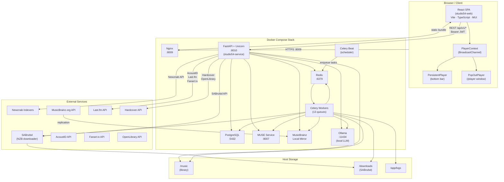
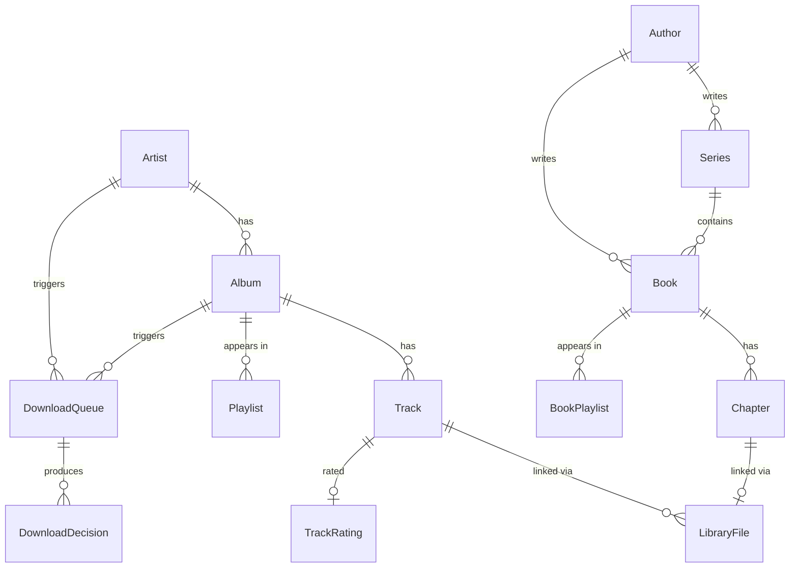
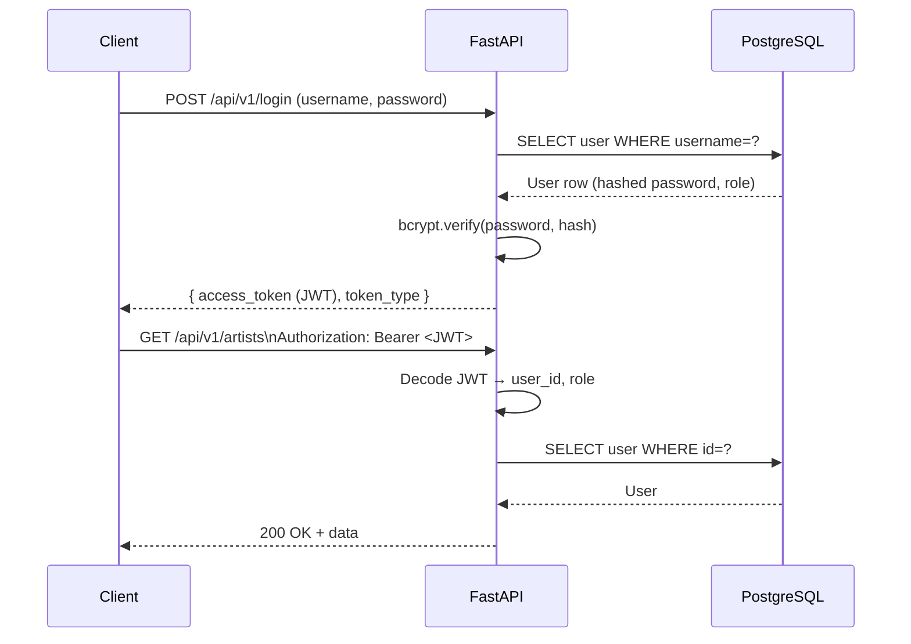
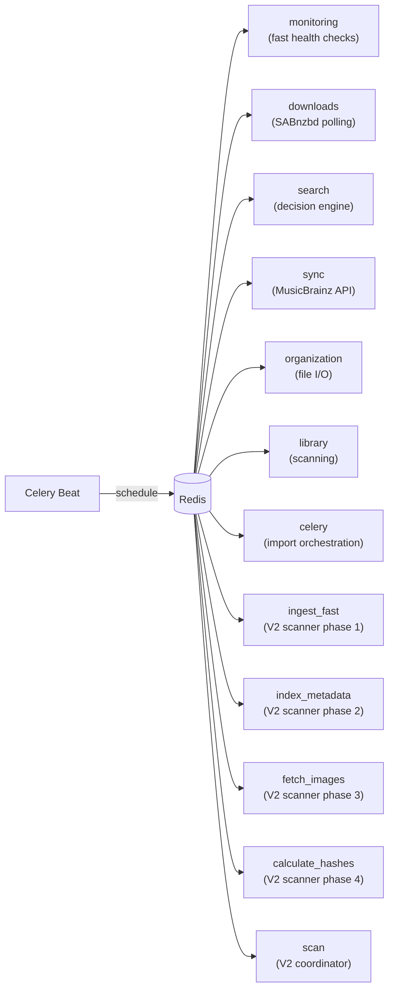
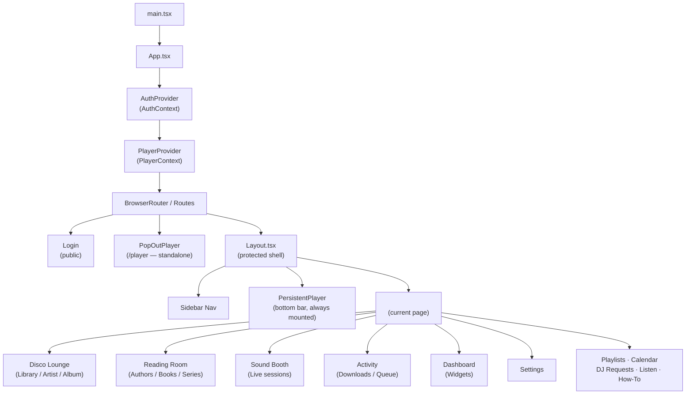
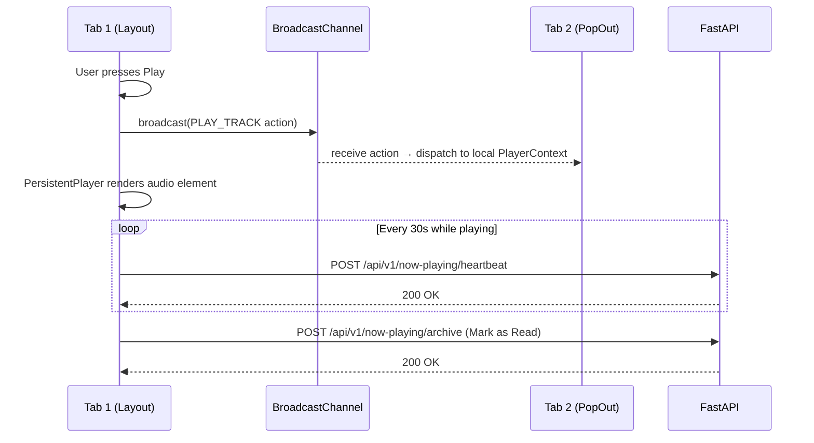
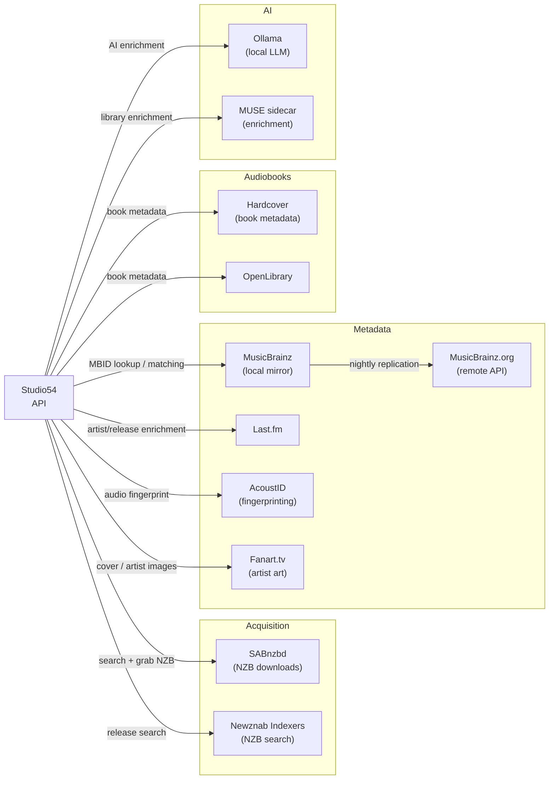

# Studio54 — System Architecture

**Version:** 1.0  
**Date:** 2026-05-14  
**Branch:** ui-update  

---

## 1. Executive Summary

Studio54 is a self-hosted music and audiobook acquisition, management, and playback platform. It operates as a full-stack web application deployed via Docker Compose and exposed to the internet at `https://studio54.homeip.net`. Its primary responsibilities are:

- **Music library management** — artist/album/track catalog backed by MusicBrainz metadata
- **Automated acquisition** — NZB search via Newznab indexers, download orchestration via SABnzbd
- **File management** — library scanning, MBID tagging, renaming, deduplication, and organization
- **Audiobook library** — authors, series, books, chapters, and resume playback
- **Playback** — in-browser audio player with cross-tab sync, now-playing heartbeat, and playlists
- **AI features** — local LLM (Ollama) for enrichment tasks

The system is architecturally divided into three independent layers: a **Python/FastAPI service** (REST API + background workers), a **React/TypeScript SPA** (browser frontend), and a **supporting infrastructure tier** (PostgreSQL, Redis, Nginx, MUSE sidecar, MusicBrainz mirror).

---

## 2. System-Level Diagram



---

## 3. Repository Structure

```
Studio54/
├── studio54-service/       # Python backend (FastAPI + Celery)
│   ├── app/
│   │   ├── api/            # FastAPI routers (one file per domain)
│   │   ├── models/         # SQLAlchemy ORM models
│   │   ├── schemas/        # Pydantic request/response schemas
│   │   ├── services/       # Business logic, external API clients
│   │   ├── shared_services/# Cross-cutting utilities (file ops, naming, audit)
│   │   ├── tasks/          # Celery task modules (one per queue domain)
│   │   └── utils/          # DB retry helpers, search utilities
│   ├── alembic/            # Database migrations
│   └── tests/              # pytest suites (unit + integration)
│
├── studio54-web/           # React/TypeScript SPA
│   └── src/
│       ├── api/            # axios client + typed API functions
│       ├── components/     # Shared UI components + dashboard widgets
│       ├── contexts/       # AuthContext, PlayerContext (global state)
│       ├── hooks/          # Custom hooks (player broadcast, URL state)
│       ├── pages/          # Route-level page components
│       └── types/          # TypeScript interface definitions
│
├── musicbrainz-docker/     # Local MusicBrainz mirror (Docker Compose)
├── applestore/             # iOS App Store packaging plan (Capacitor)
├── scripts/                # deploy.sh, install.sh, lib/
├── docker-compose.yml      # Primary stack definition
└── Architecture/           # This documentation
```

---

## 4. Backend Architecture

### 4.1 FastAPI Service

The backend is a single FastAPI application (`app/main.py`) that registers ~30 routers, all mounted under `/api/v1/`. It follows a **layered architecture**:

```
HTTP Request
    │
    ▼
FastAPI Router (app/api/*.py)
    │  — validates request via Pydantic schema
    │  — authenticates via JWT dependency
    │  — rate-limits via slowapi
    ▼
Service / Shared Service (app/services/*.py)
    │  — encapsulates business logic
    │  — calls external APIs, file system, or ORM
    ▼
SQLAlchemy ORM (app/models/*.py)
    │
    ▼
PostgreSQL
```

**Key design patterns:**
- **Dependency Injection** — `Depends(get_db)` injects a DB session per request; `Depends(get_current_user)` injects the authenticated user. Sessions are always closed in a `finally` block.
- **Router-per-domain** — each API module owns one domain (artists, albums, search, etc.) and is independently testable.
- **Startup seeding** — on first boot the application auto-seeds a default admin user and auto-configures SABnzbd if env vars are present.
- **Rate limiting** — `slowapi` wraps sensitive endpoints; the limiter is shared with the security module.

### 4.2 Data Models

The domain model covers two parallel library trees:



**Status lifecycles:**
- `Album.status`: `wanted → searching → downloading → downloaded | missing | cutoff_not_met`
- `DownloadQueue.status`: `queued → downloading → post_processing → completed | failed | blacklisted`
- `LibraryImportJob.status`: `pending → running → completed | failed | stalled`

### 4.3 Authentication & Authorization



- Tokens are signed JWTs (python-jose, HS256).
- Two roles: **`director`** (full access) and **`dj`** (read + playback, no admin).
- The frontend enforces role-gating via `<ProtectedRoute requiredRoles={[...]}>` wrappers.
- API keys (for programmatic access) are stored AES-encrypted in the database via the Fernet encryption service.

### 4.4 Configuration

All configuration flows through `app/config.py` using **pydantic-settings**, reading from environment variables and `.env` file. Key tunables:

| Setting | Purpose |
|---|---|
| `DATABASE_URL` | PostgreSQL connection string |
| `REDIS_URL` | Celery broker + result backend |
| `STUDIO54_ENCRYPTION_KEY` | Fernet key for API key encryption |
| `MUSIC_LIBRARY_PATH` | Mount path of the music library |
| `SABNZBD_HOST / PORT / API_KEY` | NZB downloader integration |
| `MUSE_SERVICE_URL` | Enrichment sidecar |
| `OLLAMA_URL` | Local LLM endpoint |
| `ALLOWED_ORIGINS` | CORS whitelist |

---

## 5. Task Queue Architecture

The background task system is the operational core of Studio54. It uses **Celery 5.4 with Redis as both broker and result backend**, and **Celery Beat** for periodic scheduling.

### 5.1 Queue Map



**Design rationale:**
- `monitoring` is isolated so health checks are never blocked by slow file I/O or API calls.
- `search` is isolated from `downloads` to prevent mutual starvation — a long search batch can't block SABnzbd polling.
- `organization` absorbs long-running file rename/move operations without starving anything else.
- V2 scanner uses four pipelined queues to parallelize the scan → metadata → image → hash phases.

### 5.2 Beat Schedule (key tasks)

| Task | Schedule | Queue |
|---|---|---|
| Monitor active downloads | 30 s | monitoring |
| Detect stalled jobs | 2 min | monitoring |
| Monitor tracked downloads | 2 min | monitoring |
| Worker autoscale check | 60 s | monitoring |
| Search wanted albums (v2) | 15 min | search |
| Retry scheduled downloads | 30 min | downloads |
| Search quality cutoff unmet | 6 h | search |
| Sync all monitored artists | 24 h | sync |
| Verify downloaded files on disk | 24 h | downloads |
| Cleanup old jobs / logs / sessions | 24 h / cron | monitoring |

All periodic tasks carry an `expires` value shorter than their schedule interval to prevent queue backlog when workers are overloaded.

### 5.3 Worker Resilience

On startup, a single worker acquires a **Redis distributed lock** (`worker_recovery_lock`) and:
1. Re-dispatches orphaned `LibraryImportJob` records (stuck `pending/running/stalled`).
2. Marks orphaned `JobState` records as `FAILED` for retry.
3. Marks orphaned `FileOrganizationJob` records as `FAILED` (resumable from checkpoint).

Long-running tasks use a **CheckpointMixin** so they can resume mid-operation after a worker restart. The Docker SDK integration enables **dynamic worker scaling** based on queue depth.

---

## 6. Frontend Architecture

### 6.1 Component Tree



### 6.2 Global State — AuthContext & PlayerContext

**AuthContext** manages the authentication lifecycle:
- JWT stored in `localStorage`
- Expiry checked on mount; auto-logout on token expiry
- User role exposed to all components

**PlayerContext** manages all playback state:
- Built with `useReducer` for predictable state transitions
- State: current track, queue, play history, shuffle/repeat, volume, session entity (music vs audiobook)
- **BroadcastChannel** (`usePlayerBroadcast`) synchronizes state across all open tabs in real-time
- Dispatches a now-playing heartbeat to the backend API (`/api/v1/now-playing`) while audio plays

### 6.3 Player Architecture



The **PersistentPlayer** is always mounted in `Layout` and never unmounts during navigation, providing gapless playback. The **PopOutPlayer** (`/player`) is a standalone route with no `Layout` wrapper — it receives state exclusively via BroadcastChannel.

### 6.4 Data Fetching

All server state is managed by **TanStack Query**:
- Auto-refetch on window focus
- Stale-while-revalidate caching
- Optimistic updates for user actions (ratings, archive)
- Typed query keys per domain

The **axios client** (`src/api/client.ts`) centralizes:
- Base URL from `VITE_API_URL` env var
- `Authorization: Bearer <token>` header injection
- 401 → auto-logout redirect

---

## 7. Infrastructure & Deployment

### 7.1 Docker Compose Services

| Service | Image | Port | Role |
|---|---|---|---|
| `studio54-web` | Nginx + static build | 8009 | SPA delivery |
| `studio54-service` | Python + Uvicorn | 8010 | REST API |
| `studio54-db` | PostgreSQL | 5432 | Primary data store |
| `studio54-redis` | Redis | 6379 | Celery broker + cache |
| `studio54-worker` | Python + Celery | — | Background tasks |
| `studio54-beat` | Python + Celery Beat | — | Periodic scheduler |
| `muse-service` | MUSE | 8007 | Music enrichment sidecar |
| `musicbrainz` | MB Docker | — | Local metadata mirror |
| `ollama` | Ollama | 11434 | Local LLM |

`studio54-web` declares a health check dependency on `studio54-service` — the web container will not start until the API reports healthy.

### 7.2 Health Check

`GET /api/v1/health` probes:
- PostgreSQL (`SELECT 1`)
- Redis (`PING`)
- SABnzbd HTTP reachability
- MUSE service HTTP reachability
- Ollama HTTP reachability
- Disk space (warns below 10 GB free)
- Music library path existence

The endpoint returns `status: healthy | degraded | unhealthy` and is used by Docker's `healthcheck` directive.

### 7.3 Storage Mounts

| Container path | Host purpose |
|---|---|
| `/music` | Music library root |
| `/downloads` | SABnzbd completed downloads |
| `/app/logs` | Application + job logs |

---

## 8. External Integration Map



---

## 9. Design Patterns Summary

| Pattern | Where Used |
|---|---|
| **Dependency Injection** | FastAPI `Depends()` for DB session, auth, limiter |
| **Repository / Service Layer** | `app/services/` isolates business logic from routers |
| **Shared Services** | `app/shared_services/` for cross-cutting concerns (file ops, naming, audit log) |
| **Strategy Pattern** | Decision engine (`decision_maker.py` + `specifications.py`) evaluates download candidates |
| **Observer / Broadcast** | `BroadcastChannel` syncs player state across browser tabs |
| **Context Provider** | React `AuthContext` + `PlayerContext` for global state without prop drilling |
| **Checkpoint / Resume** | `CheckpointMixin` on long-running Celery tasks for crash recovery |
| **Distributed Lock** | Redis lock on worker startup prevents duplicate orphan recovery |
| **Worker Autoscaling** | Docker SDK spawns/kills Celery workers based on queue depth |
| **Queue Isolation** | Dedicated Celery queues prevent slow tasks starving fast ones |
| **Optimistic Updates** | TanStack Query mutation hooks for instant UI feedback |
| **Pipelined Scanning** | V2 scanner chains 4 queues (ingest → metadata → images → hashes) |

---

## 10. Known Architectural Constraints

1. **`window.open` / `window.location.origin` usage** in `PersistentPlayer` and several pages makes native app packaging (Capacitor iOS) non-trivial — these calls are Capacitor blockers that require abstraction before mobile builds.
2. **Celery Beat is a single point of failure** — if the beat container goes down, all periodic tasks stop. No HA configuration is currently in place.
3. **SQLAlchemy sessions are synchronous** — the FastAPI app runs on Uvicorn with sync workers; async DB (e.g., asyncpg + SQLAlchemy async) is not in use.
4. **`studio54-beat` health reported as unhealthy** (per project notes) — traced to `DownloadDecision.to_dict()` at line 230; this is a known open issue.
5. **VITE_API_URL is a build-time bake-in** — changing the backend URL requires a frontend rebuild and redeploy.

---

*Next documents: `Backend.md`, `Frontend.md`, `DataModels.md`, `TaskQueue.md`, `ExternalIntegrations.md`, `Authentication.md`, `DeploymentInfrastructure.md`*
