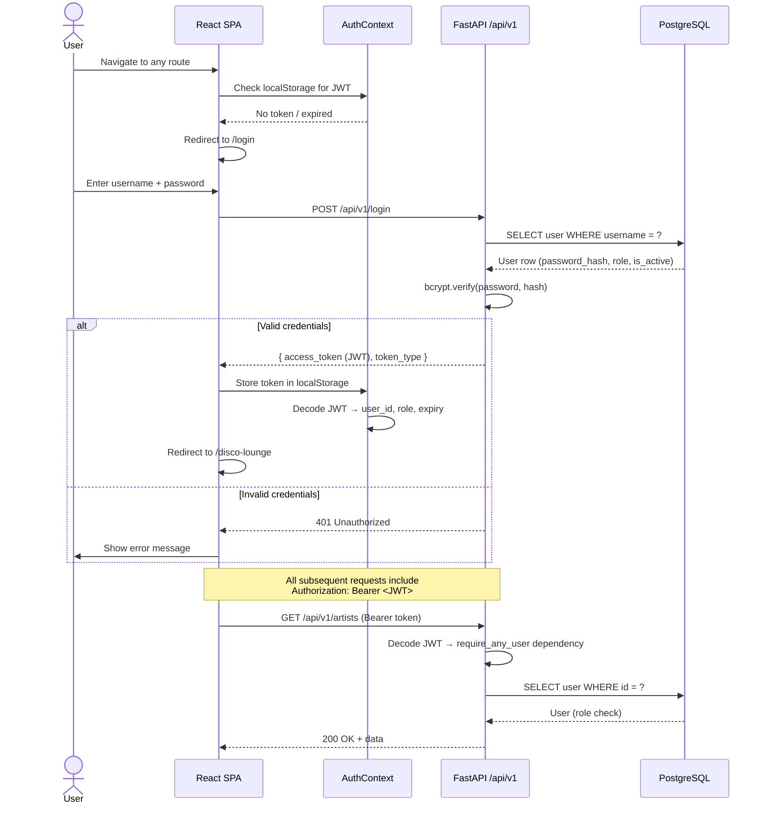
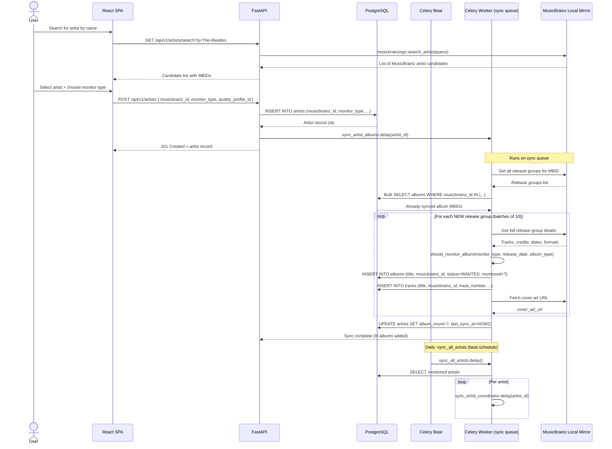
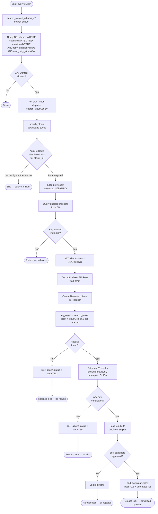
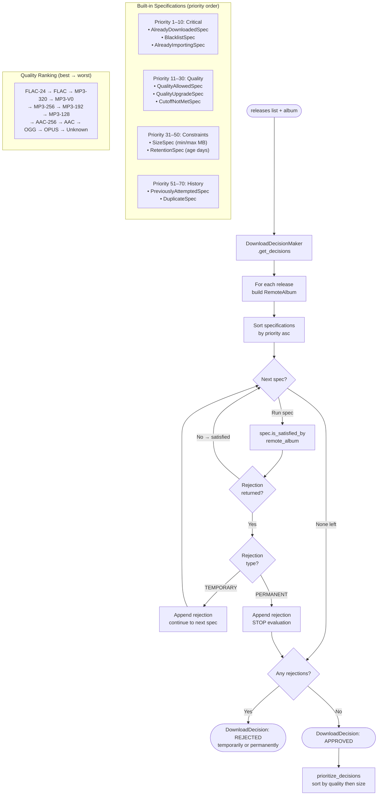
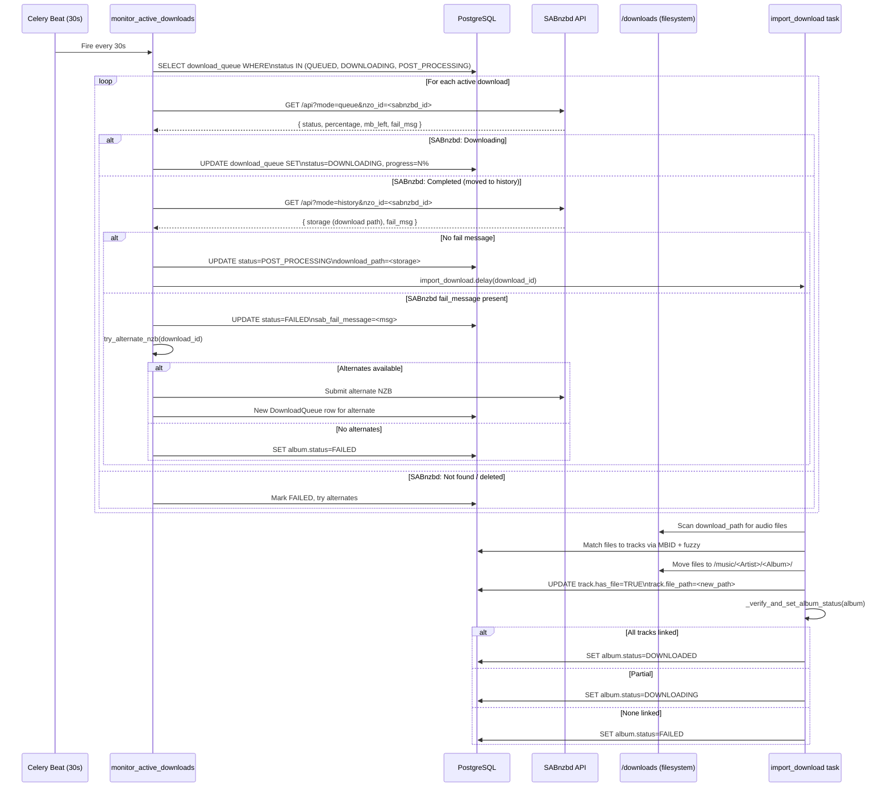
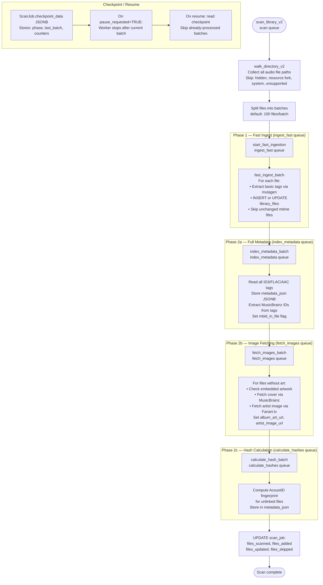
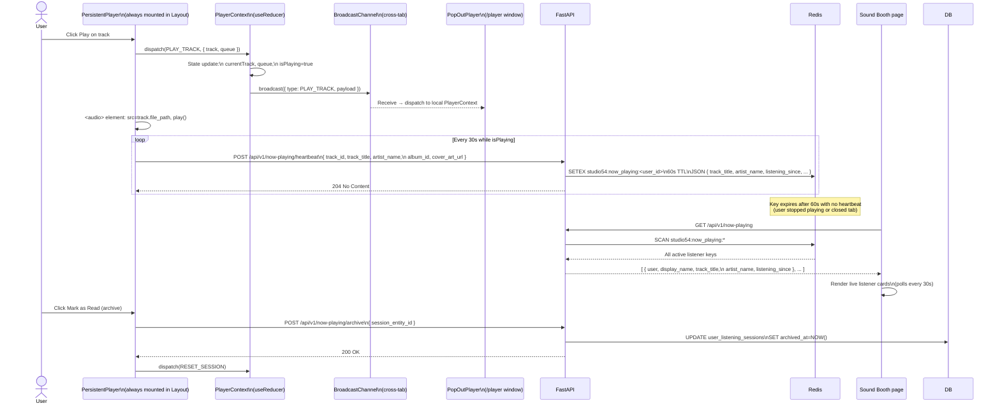
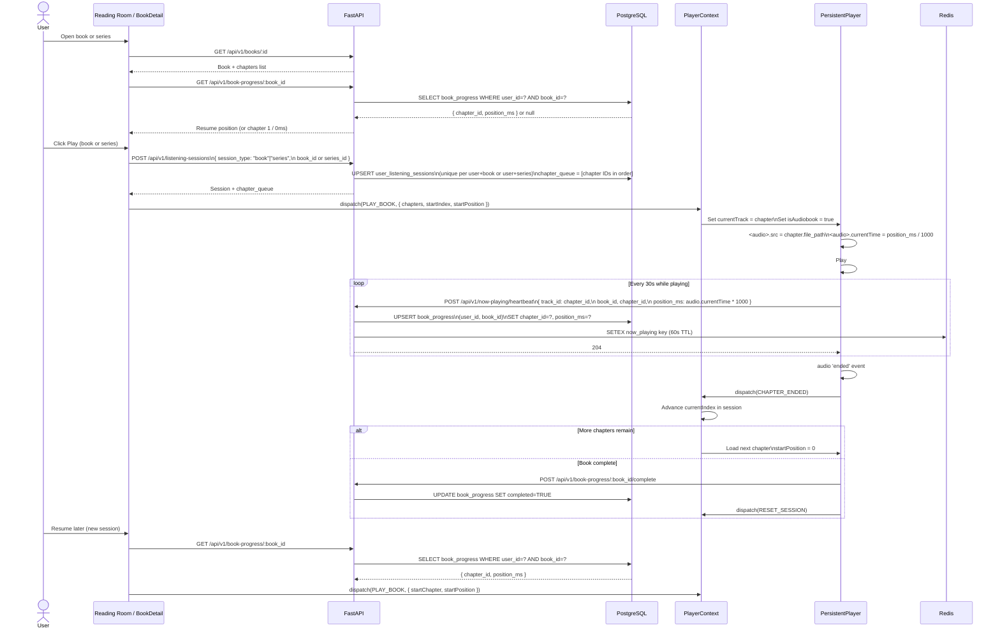
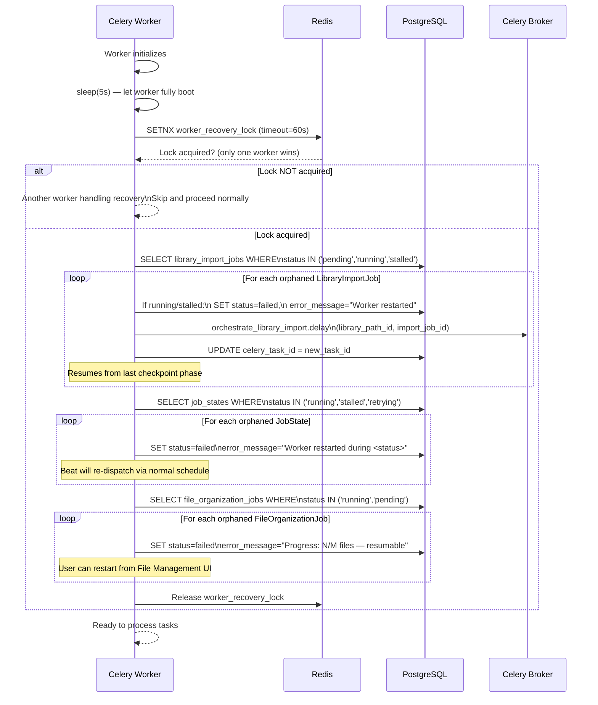

# Studio54 — Core Workflows

**Version:** 1.0  
**Date:** 2026-05-14  

---

## Table of Contents

1. [User Authentication](#1-user-authentication)
2. [Artist Add & MusicBrainz Sync](#2-artist-add--musicbrainz-sync)
3. [Automated Album Acquisition](#3-automated-album-acquisition)
4. [Decision Engine — Release Evaluation](#4-decision-engine--release-evaluation)
5. [Download Monitoring & Import](#5-download-monitoring--import)
6. [Library Scan (V2 Scanner)](#6-library-scan-v2-scanner)
7. [Library Import (6-Phase Orchestration)](#7-library-import-6-phase-orchestration)
8. [Audio Playback & Now Playing](#8-audio-playback--now-playing)
9. [Audiobook Playback & Progress Tracking](#9-audiobook-playback--progress-tracking)
10. [DJ Request Lifecycle](#10-dj-request-lifecycle)
11. [Worker Startup & Orphan Recovery](#11-worker-startup--orphan-recovery)

---

## 1. User Authentication

**Trigger:** User navigates to the app for the first time or token expires.



**Role gates enforced by `<ProtectedRoute requiredRoles={[...]}>`:**

| Route | Required Role |
|---|---|
| `/dashboard` | `director`, `dj` |
| `/file-management` | `director`, `dj` |
| `/activity` | `director`, `dj` |
| `/settings` | `director` only |
| All others | Any authenticated user |

---

## 2. Artist Add & MusicBrainz Sync

**Trigger:** User searches for and adds an artist from the Disco Lounge.



**Monitor type logic (`should_monitor_album`):**

| Monitor Type | Albums Monitored |
|---|---|
| `all_albums` | Every release group |
| `future_only` | Only releases with `release_date > today` |
| `existing_only` | Only if local files already present |
| `first_album` | Chronologically first album only |
| `latest_album` | Most recent album only |
| `none` | No albums monitored |

---

## 3. Automated Album Acquisition

**Trigger:** Celery Beat fires `search_wanted_albums_v2` every 15 minutes, or user manually triggers search.



---

## 4. Decision Engine — Release Evaluation

**Trigger:** Called by `search_album` for every candidate release from indexers.

The decision engine implements a **Specification Pattern**: each spec evaluates one rule and returns a `Rejection` or `None`. Specs are sorted by priority; a `PERMANENT` rejection short-circuits evaluation.



---

## 5. Download Monitoring & Import

**Trigger:** `monitor_active_downloads` runs every 30 seconds on the monitoring queue.



---

## 6. Library Scan (V2 Scanner)

**Trigger:** User clicks "Scan" in File Management, or `orchestrate_library_import` calls it as Phase 1.

The V2 scanner pipelines work across **four dedicated Celery queues** to parallelize discovery and enrichment.



**Skip rules in `FastMetadataExtractor.should_skip_file`:**

| Reason | Example |
|---|---|
| `resource_fork` | `._filename.mp3` (macOS) |
| `hidden` | `.DS_Store`, `.hidden_file` |
| `system` | `Thumbs.db` |
| `unsupported` | `.doc`, `.jpg`, `.pdf` |

---

## 7. Library Import (6-Phase Orchestration)

**Trigger:** User initiates an import from the File Management page. Supports full pause/resume.

```mermaid
flowchart TD
    A([orchestrate_library_import\ncelery queue]) --> B{Already\ncompleted/running?}
    B -- Yes --> Z([Skip — guard against duplicates])
    B -- No --> C{Resuming from\nfailed/paused?}
    C -- Yes --> D[Load checkpoint\nSkip completed phases]
    C -- No --> E[Mark status=running]
    D --> E

    E --> P1

    subgraph P1["Phase 1 — File Scanning (15%)"]
        P1s[scan_library_v2\nWalk filesystem\nINSERT library_files]
    end

    P1 --> P2

    subgraph P2["Phase 2 — Artist Matching (20–35%)"]
        P2s[Get unique artists from library_files\nFor each artist:\n• Search MusicBrainz by name\n• Score confidence 0–100\n• If ≥ threshold: auto-match → INSERT artist\n• If < threshold: flag manual_review\nINSERT library_artist_matches]
    end

    P2 --> P2b{All artists\nmatched?}
    P2b -- Manual review required --> WAIT[Set status=paused\nUI shows unmatched artists\nUser resolves matches]
    WAIT --> P2
    P2b -- Yes --> P3

    subgraph P3["Phase 3 — Metadata Sync (35–65%) — parallel chord"]
        P3s[Split matched artists into batches of 50\nchord sync_import_batch × N\n  | finalize_import_sync\nEach batch: sync albums+tracks from MusicBrainz]
    end

    P3 --> P4

    subgraph P4["Phase 4 — Folder Matching (65–75%)"]
        P4s[AlbumFileMatcher:\nMatch directories to album records\nby folder name similarity\nUpdate album.root_folder_path]
    end

    P4 --> P5

    subgraph P5["Phase 5 — Track Matching (75–90%)"]
        P5s[MBIDFileMatcher:\nFor each library_file:\n  1. Match via musicbrainz_trackid tag\n  2. Fallback: fuzzy title + artist match\nIf matched: UPDATE track.has_file=TRUE\n             UPDATE track.file_path\nIf not matched: INSERT unlinked_files]
    end

    P5 --> P6

    subgraph P6["Phase 6 — Finalization (90–100%)"]
        P6s[Recalculate album.status for each artist\nUpdate artist stats\nMark import_job.status=completed]
    end

    P6 --> DONE([Import complete])

    subgraph Checkpoint["Pause / Resume at any phase boundary"]
        CHK[JobCheckpointManager writes\nphase + last_artist_index to DB\nWorker checks pause_requested flag]
    end
```

---

## 8. Audio Playback & Now Playing

**Trigger:** User clicks Play on any track in the SPA.



**BroadcastChannel sync events:**

| Action | Description |
|---|---|
| `PLAY_TRACK` | Start playing a new track |
| `PAUSE` / `RESUME` | Toggle playback state |
| `SKIP_NEXT` / `SKIP_PREV` | Navigate queue |
| `SET_QUEUE` | Replace full queue |
| `VOLUME_CHANGE` | Sync volume across tabs |
| `RESET_SESSION` | Clear player after archive |

---

## 9. Audiobook Playback & Progress Tracking

**Trigger:** User opens a book or series in the Reading Room and presses Play.



---

## 10. DJ Request Lifecycle

**Trigger:** Any authenticated user submits a content request from the DJ Requests page.

```mermaid
flowchart TD
    A([User: Submit Request]) --> B[POST /api/v1/dj-requests\n{ request_type, title, artist_name,\n  musicbrainz_id, notes }]
    B --> C[INSERT dj_requests\nstatus=pending]
    C --> D([Requester sees: Pending])

    D --> E{Director reviews\nrequest}

    E -- Reject --> F[PATCH /api/v1/dj-requests/:id\n{ status: rejected, response_note }]
    F --> G([Requester notified: Rejected\nwith director note])

    E -- Approve --> H[PATCH /api/v1/dj-requests/:id\n{ status: approved, response_note }]
    H --> I{request_type?}

    I -- artist --> J[POST /api/v1/artists\nmusicbrainz_id from request]
    J --> K[Artist added + MB sync triggered]
    K --> L[PATCH status=fulfilled\nfulfilled_by_id=director_user_id]

    I -- album --> M[Find or add artist\nThen add specific album]
    M --> L

    I -- track --> N[Manual search triggered\nPOST /api/v1/search/manual\n{ artist, album, track_name }]
    N --> L

    L --> O([Requester sees: Fulfilled])
```

---

## 11. Worker Startup & Orphan Recovery

**Trigger:** Any Celery worker starts (deploy, restart, crash recovery).



**Why this matters:** Celery tasks are dispatched as Redis messages. If a worker dies mid-task, the DB record stays `running` but the Redis message is gone. Without recovery, these jobs would be stuck forever. The distributed lock ensures exactly one worker runs recovery, preventing duplicate re-dispatches on multi-worker deployments.

---

## 12. End-to-End: "Wanted Album" Happy Path

This composite diagram shows the complete happy path from artist addition through a playable downloaded album.

```mermaid
flowchart LR
    A([User adds artist]) --> B[MusicBrainz Sync\nN albums inserted\nstatus=WANTED]
    B --> C[Beat: every 15 min\nsearch_wanted_albums_v2]
    C --> D[search_album\nQuery all indexers]
    D --> E[Decision Engine\nEvaluate candidates]
    E --> F{Approved?}
    F -- No --> G[Log rejections\nAlbum stays WANTED]
    F -- Yes --> H[add_download\nSubmit best NZB to SABnzbd]
    H --> I[monitor_active_downloads\nevery 30s]
    I --> J{SABnzbd\ncomplete?}
    J -- No --> I
    J -- Yes --> K[import_download\nMove files to /music/]
    K --> L[Link tracks\nhas_file=TRUE, file_path=?]
    L --> M[album.status=DOWNLOADED]
    M --> N([User plays album\nin PersistentPlayer])
    N --> O[Heartbeat → Redis\nNow Playing: Sound Booth]
```



---

*Next documents: `Backend_API.md`, `Frontend.md`, `TaskQueue.md`, `ExternalIntegrations.md`*
